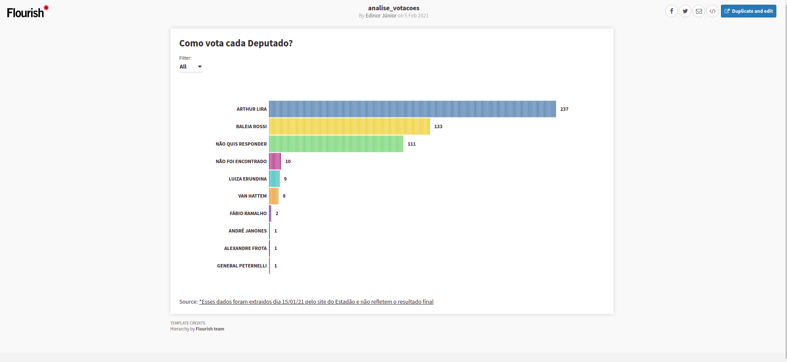
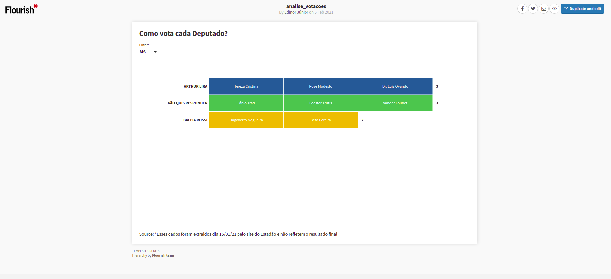

# Machine_Learning_Engineer
   

  

# First Flourish Visualization
*Machine Learning Engineer

This is an implementation of data visualization using Flourish. To create this, first, I scrape a webpage to gather data and build a dataframe. 
Each step of this scraping process is in the notebook's code.
So, I chose to use Flourish to visualize the data, has some many ways to do that, a good florish example tutorial can be found here [How To Make a Racing Bar Chart with Flourish Studio](https://www.youtube.com/watch?v=JBS2X2HC9Hc)

**Screenshot from the project running**

  

  

**Access the visualization on:**
[Flourish Studio](https://public.flourish.studio/visualisation/5179248/)

**Links:**
* [LinkedIn](https://www.linkedin.com/in/edinorjr)
* [Streamlit](https://www.streamlit.io/)
---

